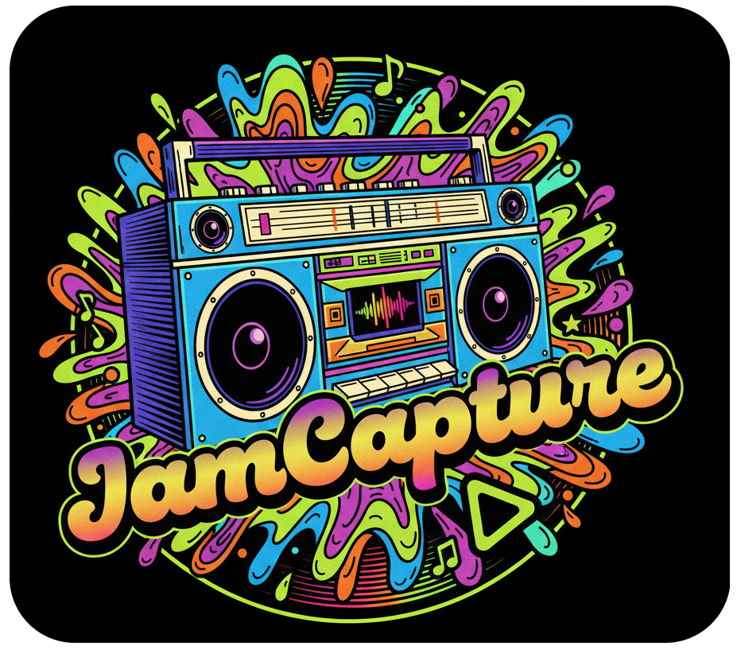

<div align="center">
  
  <h1>JamCapture Master Documentation</h1>
  <p><em>Auto-generated and maintained</em></p>
</div>

## 🎯 Quick Start & Testing

### Primary Test Command
```bash
# Main end-to-end pipeline test
./tests/e2e-test.sh
```

### Build & Web Server Commands
```bash
# Build
go build

# Web server (smartphone control)
./jamcapture serve --port 8080
```

---

## 🏗️ Architecture Overview

JamCapture uses a **layered service architecture** with unified interfaces:

```
┌─────────────────────────────────────────────────────────────┐
│                      CLIENT LAYER                           │
├─────────────────────────────────────────────────────────────┤
│                    Web Server                               │
│  - internal/server/server.go                               │
│  - REST endpoints                                           │
│  - WebUI interface                                          │
│  - Mobile-optimized controls                               │
└─────────────────────────────────────────────────────────────┘
                          │
                          ▼
┌─────────────────────────────────────────────────────────────┐
│                   SERVICE LAYER                            │
│            internal/service/service.go                     │
│                                                             │
│  🔄 Unified Interface: Service                              │
│  - StartRecording(songName) error                          │
│  - StopRecording() error                                    │
│  - GetRecordingStatus() (Status, *Session)                 │
│  - Mix(songName) error                                      │
│  - MixWithOptions(songName, volumes...) error              │
│  - Play(songName) error                                     │
│  - RunPipeline(songName, steps) error                      │
│  - LoadProfile(profile) error                              │
│  - GetConfig() *Config                                      │
│  - GetSongInfo(songName) (*SongInfo, error)                │
│  - ListJackSources() ([]string, error)                     │
└─────────────────────────────────────────────────────────────┘
                          │
                          ▼
┌─────────────────────────────────────────────────────────────┐
│                  CORE COMPONENTS LAYER                     │
├─────────────────────────┬───────────────────────────────────┤
│   internal/audio/       │   internal/mix/                   │
│   - recorder.go         │   - mixer.go                      │
│   - pipewire.go         │                                   │
├─────────────────────────┼───────────────────────────────────┤
│   internal/play/        │   internal/config/                │
│   - player.go           │   - config.go                     │
└─────────────────────────┴───────────────────────────────────┘
                          │
                          ▼
┌─────────────────────────────────────────────────────────────┐
│                 EXTERNAL DEPENDENCIES                      │
│  - PipeWire/JACK (Audio routing)                           │
│  - FFmpeg (Audio processing)                               │
│  - OS Audio system                                         │
└─────────────────────────────────────────────────────────────┘
```

### Key Architecture Benefits
- 🔄 **Unified Interface**: Single service layer for CLI and Web
- 🧪 **Testability**: Mockable interfaces, isolated components
- 🔧 **Maintainability**: Centralized business logic, clear separation
- 📡 **Extensibility**: Easy to add new clients, stable API

---

## 🔧 Technical Implementation

### Core Audio Stack
- **Language**: Go (Golang)
- **Audio Server**: PipeWire (JACK interface via `pw-jack`)
- **Engine**: FFmpeg (external process)
- **Routing**: Dynamic `pw-link` connections

### Critical Recording Architecture
⚠️ **IMPORTANT - Always Follow This Pattern**

1. **JACK-Only**: Never use `-f pulse` (causes clock drift)
2. **JACK Bus**: Launch FFmpeg as multi-channel JACK client:
   ```bash
   pw-jack ffmpeg -f jack -channels N -i jamcapture_rec
   ```
3. **Dynamic Linking**:
   - Start FFmpeg → Wait for JACK ports
   - Connect: `pw-link source_port jamcapture_rec:input_X`
4. **Timing**: 1-second wait + 5 retries with 500ms delays

### ⭐ NEW: One Track Per Channel with Metadata

**Major Change (Latest)**: Recording now creates **one track per channel** in MKV file with metadata:

#### Recording Structure (buildFFmpegCommand):
```bash
pw-jack ffmpeg -f jack -channels 4 -i jamcapture_rec -ar 48000 \
-map 0:a:0 -metadata:s:a:0 title="guitar" \
-map 0:a:1 -metadata:s:a:1 title="mic" \
-map 0:a:2 -metadata:s:a:2 title="monitor_left" \
-map 0:a:3 -metadata:s:a:3 title="monitor_right" \
-c:a flac output.mkv
```

#### Benefits:
- 📊 **One track per channel**: No automatic mixing during recording
- 🏷️ **Channel metadata**: Each track has `title=channel_name` metadata
- 📐 **Order preserved**: Tracks follow exact configuration order
- 🎛️ **Maximum flexibility**: Full post-processing control

### Channel-Based Configuration
- **Unified Structure**: Single `channels[]` array with `name`, `source`, `type`, `volume`, `delay`
- **Removed Duplication**: Merged `mix.channels[]` into main `channels[]`
- **Inheritance System**: Profile-specific vs inherited values tracking
- **Dynamic**: FFmpeg channel count based on enabled channels

### Stream Mapping (Updated)
- **NEW Recorder Output**:
  - Track `0:0`: First channel (with metadata)
  - Track `0:1`: Second channel (with metadata)
  - Track `0:N`: Nth channel (with metadata)
- **Mixer Input**: Maps to individual tracks `[0:0]`, `[0:1]`, `[0:N]`

---

## ⚙️ Configuration

### Modern Configuration Structure (Reference-Based)
```yaml
active_config: "xr18_studio"

# Global settings applied to all profiles
audio:
  backend: pipewire
  sample_rate: 48000

globals:
  output:
    recordings_directory: ~/Audio/JamCapture/Recordings
    backingtracks_directory: ~/Audio/JamCapture/BackingTracks

# Channel definitions (reusable across profiles)
definitions:
  channels:
    - id: guitar
      name: guitar
      sources: ["Scarlett 2i2 3rd Gen:capture_FR"]
      audioMode: mono
      type: input
      volume: 4.0
      delay: 0

    - id: mic
      name: mic
      sources: ["Scarlett 2i2 3rd Gen:capture_FL"]
      audioMode: mono
      type: input
      volume: 3.0
      delay: 0

    - id: chrome_stereo
      name: chrome
      sources: ["Chrome:output_FL", "Chrome:output_FR"]
      audioMode: stereo
      type: monitor
      volume: 0.8
      delay: 250

# Recording profiles (reference channel definitions)
configs:
  studio:
    auto_mix: true
    channels:
      - ref: guitar
      - ref: mic
      - ref: chrome_stereo
        volume: 0.6  # Override default volume
    output:
      format: flac

  guitar_only:
    auto_mix: true
    channels:
      - ref: guitar
        volume: 5.0  # Boost for solo recording
    output:
      format: wav

supported_audio_extensions: [flac, wav, mp3]
```

### Configuration Benefits
- **Reusable Definitions**: Define channels once, reference in multiple profiles
- **Global Settings**: Audio backend and directories shared across profiles
- **Profile Inheritance**: Override specific parameters per profile
- **Volume/Delay Overrides**: Customize channel settings per profile

---

## 🧪 Testing & Quality

### E2E Testing Pipeline
```bash
./tests/e2e-test.sh
```
**What it tests**:
- JACK recording with dynamic channels
- Port connection timing and retry logic
- One-track-per-channel recording with metadata
- Audio mixing with individual track processing
- File integrity validation
- Audio signal detection (verifies actual content)

### Unit Testing
- **buildFFmpegCommand tests**: Validates command generation with metadata
- **Config merge tests**: Inheritance and profile systems
- **Port validation tests**: JACK port format validation

---

## 📈 Development Progress & History

### ✅ Latest Updates (Current)
1. **Profile Locking System**: Prevents concurrent profile modifications during recording
2. **Optimized Profile Loading**: Removed unnecessary polling, load only on-demand
3. **Enhanced Error Messages**: Specific feedback for deleted/changed profiles
4. **One Track Per Channel**: Each channel → separate track with metadata
5. **Unified Channel Config**: Merged `mix.channels` into main `channels[]`
6. **Comprehensive Tests**: Unit tests for buildFFmpegCommand function

### ✅ Recently Completed
1. **Service Layer Architecture**: Unified interface between CLI/Web
2. **Keyboard Recording Control**: Press Enter to stop recording
3. **Test Infrastructure**: Organized testing with named audio sources
4. **Code Deduplication**: Removed redundant recorder implementations

### ✅ Core Foundation
1. **PipeWire-JACK Integration**: Sample-perfect synchronization
2. **Dynamic FFmpeg**: Multi-channel JACK client with individual tracks
3. **Port Management**: Automatic discovery and connection
4. **Structured Logging**: Comprehensive slog integration
5. **Multi-format Support**: FLAC, WAV, MP3 output options

---

## 🔍 Known Issues & Status

### Current Status: ✅ STABLE
- **System Stability**: Excellent - No critical issues
- **Configuration**: Unified and validated structure with profile locking
- **Performance**: Optimized profile loading, timing issues resolved
- **Recording**: One track per channel with metadata
- **Session Safety**: Profile locking prevents concurrent modifications
- **Compatibility**: Full PipeWire-JACK integration

### All Major Issues Resolved ✅
- ~~Guitar signal missing~~ → **Fixed**: Correct port mapping
- ~~FFmpeg stream errors~~ → **Fixed**: Individual track structure
- ~~JACK connection timeouts~~ → **Fixed**: Retry logic + timing
- ~~Port validation failures~~ → **Fixed**: Comprehensive detection
- ~~Code duplication~~ → **Fixed**: Service layer architecture
- ~~Config duplication~~ → **Fixed**: Unified channel structure

---

## 🌟 Web Server Features (Primary Interface)

### Mobile-Optimized Recording Control
- **Smartphone Interface**: Large touch controls perfect for use while holding instruments
- **State Machine**: STANDBY → READY → RECORDING → STANDBY with visual feedback
- **Auto-mix**: Automatic FLAC generation with profile-based volume/delay settings
- **Profile Management**: Dynamic switching with session locking during recording
- **Real-time Validation**: Audio source monitoring and JACK port status

### Advanced Web Features
- **File Browser**: Stream/download recordings directly from interface
- **Audio Player**: HTML5 player supporting FLAC, WAV, MP3, MKV formats
- **Backing Tracks**: Upload and play along with backing audio
- **Live Monitoring**: Real-time FFmpeg output and system logs
- **Session Safety**: Profile locking prevents changes during active recordings

## 🚀 Web Interface Usage

### Starting the Web Server
```bash
# Start smartphone-controlled recording
./jamcapture serve --port 8080
# Access from mobile: http://your-ip:8080

# With specific configuration
./jamcapture --config examples/pipewire.yaml serve
```

### Web API Integration
```bash
# State-based recording API
curl -X POST http://localhost:8080/ready -d "song=test&profile=studio&auto_mix=true"
curl -X POST http://localhost:8080/stop

# System monitoring
curl http://localhost:8080/status
curl http://localhost:8080/sources

# File management
curl http://localhost:8080/api/files
curl http://localhost:8080/api/latest-recording
```

---

## 📚 Development Guidelines

### Code Quality Standards
- **Architecture**: Clean layer separation via service interface
- **Recording**: One track per channel with metadata approach
- **Error Handling**: Comprehensive validation with user-friendly messages
- **Testing**: E2E + unit test coverage with actual audio validation
- **Documentation**: Keep this master doc updated with changes

### Performance Characteristics
- **Latency**: Optimized for low-latency with configurable delays
- **Resource Usage**: Efficient FFmpeg usage, minimal overhead
- **Reliability**: Retry logic ensures stable connections
- **Flexibility**: Individual tracks allow maximum post-processing control