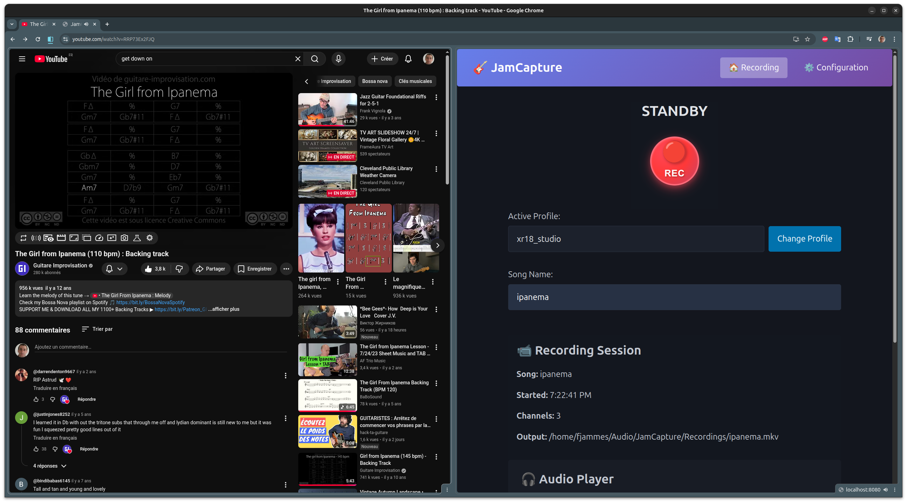

<div align="center">
  
  <h1>JamCapture</h1>
  <p><em>A professional audio recording tool for musicians with mobile-optimized web interface.</em></p>
</div>

## Features

- **Mobile-First Web Interface**: Control recording from your smartphone while playing
- **Multi-channel Recording**: Capture guitar, microphone, and system audio via JACK/PipeWire
- **Smart Mixing**: Automatic track mixing with volume control and latency compensation
- **Profile System**: YAML-based configuration with inheritance and multiple recording setups
- **Real-time Monitoring**: Live status updates, audio source detection, and log streaming
- **File Management**: Built-in audio player, file browser, and backing track support

<div align="center">
  
  <p><em>Mobile-optimized web interface for smartphone recording control</em></p>
</div>

## Quick Start

```bash
# Build the application
go build

# Start web interface (recommended)
./jamcapture serve --port 8080
# Open http://your-ip:8080 on your smartphone

# With custom configuration
./jamcapture --config examples/pipewire.yaml serve
```

## Configuration

JamCapture uses a modern reference-based configuration system:

```yaml
active_config: "xr18_studio"

# Global settings
audio:
  backend: pipewire
  sample_rate: 48000

globals:
  output:
    recordings_directory: ~/Audio/JamCapture/Recordings
    backingtracks_directory: ~/Audio/JamCapture/BackingTracks

# Channel definitions (reusable)
definitions:
  channels:
    - id: guitar
      name: guitar
      sources: ["Scarlett 2i2 3rd Gen:capture_FR"]
      audioMode: mono
      type: input
      volume: 4.0
      delay: 0

    - id: chrome_stereo
      name: chrome
      sources: ["Chrome:output_FL", "Chrome:output_FR"]
      audioMode: stereo
      type: monitor
      volume: 0.8
      delay: 250

# Recording profiles
configs:
  studio:
    auto_mix: true
    channels:
      - ref: guitar
      - ref: chrome_stereo
        volume: 0.6  # Override volume
    output:
      format: flac

supported_audio_extensions: [flac, wav, mp3]
```

See `examples/pipewire.yaml` for complete configuration examples.

## Web Interface Usage

### Smartphone Recording Control

1. **Start the server**: `./jamcapture serve --port 8080`
2. **Open on mobile**: Visit the displayed network URL (e.g., `http://192.168.1.15:8080`)
3. **Select profile**: Choose your recording setup (studio, guitar-only, etc.)
4. **Enter song name**: Name your recording session
5. **Ready**: Prepare recording (connects audio sources)
6. **Record**: Start recording with large red button
7. **Stop**: End recording (auto-mixes if enabled)

### Web Interface Features

- **Large Touch Controls**: Guitar-friendly buttons for easy use while playing
- **Real-time Status**: Live recording progress and audio source monitoring
- **Profile Management**: Switch between recording setups
- **Auto-mix**: Automatically generate mixed files after recording
- **File Browser**: Stream, download, and manage recordings
- **Backing Tracks**: Upload and play along functionality
- **Mobile-optimized**: Responsive design with dark/light themes

### API Endpoints

```bash
# Recording control
curl -X POST http://localhost:8080/ready -d "song=test&profile=studio"
curl -X POST http://localhost:8080/record
curl -X POST http://localhost:8080/stop

# System monitoring
curl http://localhost:8080/status
curl http://localhost:8080/sources

# File management
curl http://localhost:8080/api/files
curl http://localhost:8080/api/latest-recording
```

## Profile System

JamCapture supports multiple recording profiles managed through the web interface:

- **Channel Definitions**: Reusable audio source configurations
- **Profile Inheritance**: Override specific settings per recording setup
- **Global Settings**: Shared audio backend and directories
- **Volume/Delay Overrides**: Customize per profile without duplicating definitions

Profiles are automatically loaded and can be switched in the web interface dropdown.

## File Structure

- **Recordings**: `~/Audio/JamCapture/Recordings/{song}.mkv` (multi-track)
- **Mixed output**: `~/Audio/JamCapture/Recordings/{song}.flac` (auto-mixed)
- **Backing tracks**: `~/Audio/JamCapture/BackingTracks/`
- **Configuration**: `examples/pipewire.yaml`

## Requirements

- **FFmpeg**: For audio recording and mixing
- **PipeWire with JACK support**: `pw-jack` command must be available
- **Modern web browser**: For mobile interface (Chrome, Firefox, Safari)
- **Audio interface**: Hardware with JACK-compatible drivers

## Development

```bash
# Run tests
./tests/e2e-test.sh

# Build
go build

# Test configuration
./jamcapture --config examples/pipewire.yaml sources
```