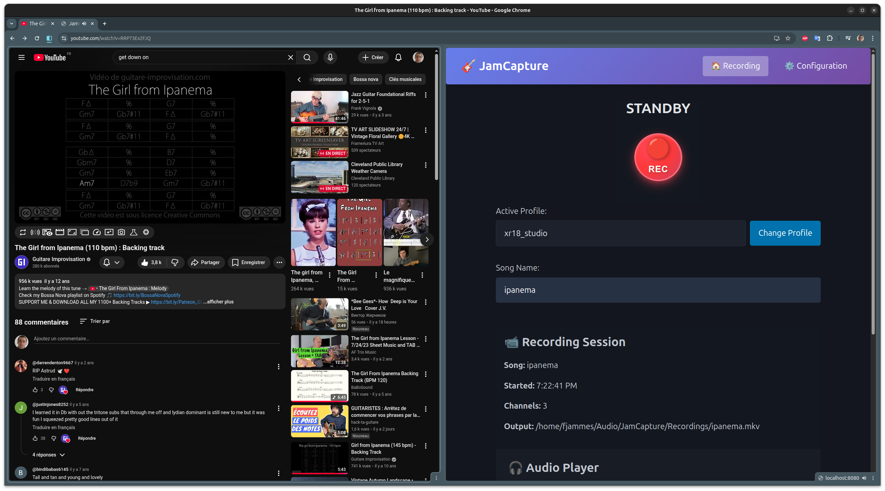

<div align="center">
  
  <h1>JamCapture</h1>
  <p><em>A professional audio recording tool for musicians with web interface.</em></p>
</div>

## Features

- **Web Interface**: Control recording from your browser/smartphone while playing
- **Multi-channel Recording**: Capture guitar, microphone, and system audio via JACK/PipeWire
- **Smart Mixing**: Automatic track mixing with volume control and latency compensation
- **Profile System**: YAML-based configuration with multiple recording setups
- **Real-time Monitoring**: Live status updates, audio source detection, and log streaming
- **File Management**: Built-in audio player, file browser, and backing track support

<div align="center">
  
  <p><em>Web interface for browser/smartphone recording control</em></p>
</div>

## Installation

### Latest Release (Recommended)

```bash
# Linux (amd64)
curl -L -o jamcapture https://github.com/AudioLibreLab/JamCapture/releases/latest/download/jamcapture-linux-amd64
chmod +x jamcapture
sudo mv jamcapture /usr/local/bin/

# Linux (arm64)
curl -L -o jamcapture https://github.com/AudioLibreLab/JamCapture/releases/latest/download/jamcapture-linux-arm64
chmod +x jamcapture
sudo mv jamcapture /usr/local/bin/
```

### Build from Source

```bash
# Clone and build
git clone https://github.com/AudioLibreLab/JamCapture.git
cd JamCapture
go build
```

## Quick Start

```bash
# Start web interface (recommended)
./jamcapture serve --port 8080
# Open http://your-ip:8080 on your smartphone

# With custom configuration
./jamcapture --config examples/pipewire.yaml serve
```

## Configuration

### Audio Source Discovery

First, discover your audio interface sources:

```bash
# Install PipeWire utilities (Ubuntu/Debian)
sudo apt-get install pipewire-utils

# List all available audio sources
pw-link -io

# Filter for specific hardware (e.g., Scarlett interface)
pw-link -io | grep -i scarlett
```

Example Scarlett 2i2 output:
```
alsa_input.usb-Focusrite_Scarlett_2i2_USB_Y814JK8264026F-00.analog-stereo:capture_FL
alsa_input.usb-Focusrite_Scarlett_2i2_USB_Y814JK8264026F-00.analog-stereo:capture_FR
alsa_output.usb-Focusrite_Scarlett_2i2_USB_Y814JK8264026F-00.analog-stereo:playback_FL
alsa_output.usb-Focusrite_Scarlett_2i2_USB_Y814JK8264026F-00.analog-stereo:playback_FR
```

### Configuration Example

JamCapture uses a modern reference-based configuration system:

```yaml
active_config: "scarlett_studio"

# Global settings
audio:
  backend: pipewire
  sample_rate: 48000

globals:
  output:
    recordings_directory: ~/Audio/JamCapture/Recordings
    backingtracks_directory: ~/Audio/JamCapture/BackingTracks

# Channel definitions (reusable)
definitions:
  channels:
    - id: guitar
      name: guitar
      sources: ["alsa_input.usb-Focusrite_Scarlett_2i2_USB_Y814JK8264026F-00.analog-stereo:capture_FR"]
      audioMode: mono
      type: input
      volume: 4.0
      delay: 0

    - id: microphone
      name: microphone
      sources: ["alsa_input.usb-Focusrite_Scarlett_2i2_USB_Y814JK8264026F-00.analog-stereo:capture_FL"]
      audioMode: mono
      type: input
      volume: 3.0
      delay: 0

    - id: chrome_stereo
      name: chrome
      sources: ["Chrome:output_FL", "Chrome:output_FR"]
      audioMode: stereo
      type: monitor
      volume: 0.8
      delay: 250

# Recording profiles
configs:
  scarlett_studio:
    auto_mix: true
    channels:
      - ref: guitar
      - ref: microphone
      - ref: chrome_stereo
        volume: 0.6  # Override volume
    output:
      format: flac

  guitar_only:
    auto_mix: true
    channels:
      - ref: guitar
        volume: 5.0  # Boost for solo recording
    output:
      format: wav

supported_audio_extensions: [flac, wav, mp3]
```

**Important**: Use the exact port names from `pw-link -io` output in your `sources` fields.

See `examples/pipewire.yaml` for complete configuration examples.

## Web Interface Usage

### Recording Control

1. **Start the server**: `./jamcapture serve --port 8080`
2. **Open on browser**: Visit the displayed network URL (e.g., `http://192.168.1.15:8080`)
3. **Select profile**: Choose your recording setup (studio, guitar-only, etc.)
4. **Enter song name**: Name your recording session
5. **Ready**: Prepare recording (connects audio sources)
6. **Record**: Start recording with large red button
7. **Stop**: End recording (auto-mixes if enabled)

### Web Interface Features

- **Large Touch Controls**: Guitar-friendly buttons for easy use while playing
- **Real-time Status**: Live recording progress and audio source monitoring
- **Profile Management**: Switch between recording setups
- **Auto-mix**: Automatically generate mixed files after recording
- **File Browser**: Stream, download, and manage recordings
- **Backing Tracks**: Upload and play along functionality
- **Mobile-optimized**: Responsive design with dark/light themes

## Profile System

JamCapture supports multiple recording profiles managed through the web interface:

- **Channel Definitions**: Reusable audio source configurations
- **Profile Inheritance**: Override specific settings per recording setup
- **Global Settings**: Shared audio backend and directories
- **Volume/Delay Overrides**: Customize per profile without duplicating definitions

Profiles are automatically loaded and can be switched in the web interface dropdown.

## File Structure

- **Recordings**: `~/Audio/JamCapture/Recordings/{song}.mkv` (multi-track)
- **Mixed output**: `~/Audio/JamCapture/Recordings/{song}.flac` (auto-mixed)
- **Backing tracks**: `~/Audio/JamCapture/BackingTracks/`
- **Configuration**: `examples/pipewire.yaml`

## Requirements

### System Requirements

- **PipeWire**: Must be active and running on the system
- **FFmpeg**: For audio recording and mixing
- **PipeWire JACK support**: `pw-jack` command must be available
- **Modern web browser**: For mobile interface (Chrome, Firefox, Safari)
- **Audio interface**: Hardware with JACK-compatible drivers

### Verify PipeWire Status

Check that PipeWire is running before using JamCapture:

```bash
# Check PipeWire service status
systemctl --user status pipewire

# Verify PipeWire is processing audio
pw-cli list-objects

# Check JACK support is available
which pw-jack
```

If PipeWire is not running, start it:

```bash
# Start PipeWire service
systemctl --user start pipewire pipewire-pulse

# Enable auto-start on boot
systemctl --user enable pipewire pipewire-pulse
```

## Development

```bash
# Run tests
./tests/e2e-test.sh

# Build
go build

# Test configuration
./jamcapture --config examples/pipewire.yaml sources
```
