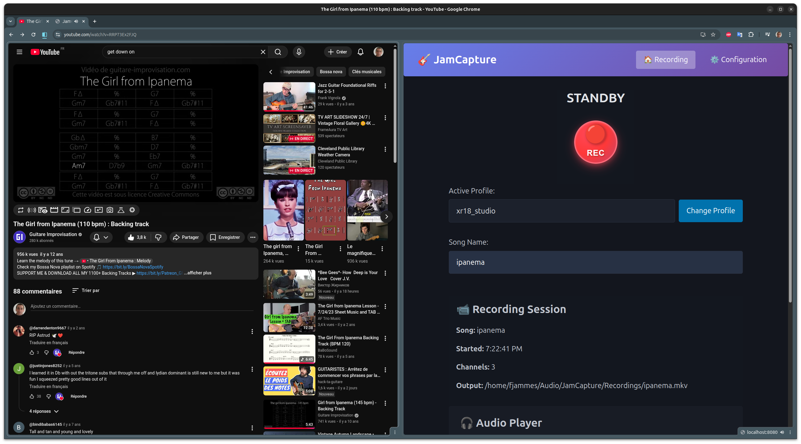

<div align="center">
  
  <h1>JamCapture</h1>
  <p><em>A professional audio recording tool for musicians with web interface.</em></p>
</div>

## Features

- **Zero-config first run**: `jamcapture serve` auto-detects all audio sources and writes a ready-to-use config
- **Web Interface**: Control recording from your browser/smartphone while playing
- **Multi-channel Recording**: Capture guitar, microphone, and system audio via JACK/PipeWire
- **Smart Mixing**: Automatic track mixing with volume control and latency compensation
- **Profile System**: YAML-based configuration with multiple recording setups
- **Real-time Monitoring**: Live status updates, audio source detection, and log streaming
- **File Management**: Built-in audio player, file browser, and backing track support

<div align="center">
  
  <p><em>Web interface for browser/smartphone recording control</em></p>
</div>

## Installation

### One-liner (Recommended)

```bash
curl -fsSL https://raw.githubusercontent.com/AudioLibreLab/JamCapture/main/install.sh | bash
```

Installs to `/usr/local/bin/`. For a user-local install (no sudo):

```bash
curl -fsSL https://raw.githubusercontent.com/AudioLibreLab/JamCapture/main/install.sh | INSTALL_DIR=~/.local/bin bash
```

### Manual Download

```bash
# Linux (amd64)
curl -L -o jamcapture https://github.com/AudioLibreLab/JamCapture/releases/latest/download/jamcapture-linux-amd64
chmod +x jamcapture
sudo mv jamcapture /usr/local/bin/
```

### Build from Source

```bash
git clone https://github.com/AudioLibreLab/JamCapture.git
cd JamCapture
go build
```

## Quick Start

```bash
# Start the web server — auto-detects audio sources and creates config on first run
jamcapture serve

# Open the displayed URL on your smartphone (e.g. http://192.168.1.x:8080)
```

On first launch with no config, `jamcapture serve` automatically runs `pw-link -io`,
detects all connected hardware and software audio sources, writes
`~/.config/jamcapture.yaml`, and starts the server.

To regenerate or inspect the config:

```bash
jamcapture config init   # re-detect sources and overwrite config (backs up old one)
jamcapture sources       # list currently available audio sources
jamcapture config show   # display the resolved active configuration
```

## Configuration

### Auto-generated config

On first run, `jamcapture serve` (or `jamcapture config init`) detects all available
PipeWire/JACK sources and writes `~/.config/jamcapture.yaml` automatically.

For a system with a Scarlett 2i2 and Chrome open, the generated config looks like:

```yaml
active_config: default
audio:
  backend: pipewire
  sample_rate: 48000
globals:
  output:
    recordings_directory: ~/Audio/JamCapture/Recordings
    backingtracks_directory: ~/Audio/JamCapture/BackingTracks
definitions:
  channels:
    - id: hw_input_1
      audiomode: mono
      type: input
      volume: 4.0
      delay: 0
      sources:
        - alsa_input.usb-Focusrite_Scarlett_2i2_USB_Y814JK8264026F-00.analog-stereo:capture_FL
    - id: hw_input_2
      audiomode: mono
      type: input
      volume: 4.0
      delay: 0
      sources:
        - alsa_input.usb-Focusrite_Scarlett_2i2_USB_Y814JK8264026F-00.analog-stereo:capture_FR
    - id: chrome_stereo
      audiomode: stereo
      type: monitor
      volume: 0.8
      delay: 0
      sources:
        - Chrome:output_FL
        - Chrome:output_FR
configs:
  default:
    auto_mix: true
    channels:
      - ref: hw_input_1
      - ref: hw_input_2
      - ref: chrome_stereo
    output:
      format: flac
supported_audio_extensions: [flac, wav, mp3]
```

### Customizing the config

Edit `~/.config/jamcapture.yaml` to adjust volumes, delays, and add profiles.
To find available port names:

```bash
# Install PipeWire utilities if needed (Ubuntu/Debian)
sudo apt-get install pipewire-utils

jamcapture sources      # list detected sources (recommended)
pw-link -io             # raw PipeWire port list
pw-link -io | grep -i scarlett
```

See `examples/pipewire.yaml` for a multi-profile configuration example.

## Web Interface Usage

### Recording Control

1. **Start the server**: `./jamcapture serve --port 8080`
2. **Open on browser**: Visit the displayed network URL (e.g., `http://192.168.1.15:8080`)
3. **Select profile**: Choose your recording setup (studio, guitar-only, etc.)
4. **Enter song name**: Name your recording session
5. **Ready**: Prepare recording (connects audio sources)
6. **Record**: Start recording with large red button
7. **Stop**: End recording (auto-mixes if enabled)

### Web Interface Features

- **Large Touch Controls**: Guitar-friendly buttons for easy use while playing
- **Real-time Status**: Live recording progress and audio source monitoring
- **Profile Management**: Switch between recording setups
- **Auto-mix**: Automatically generate mixed files after recording
- **File Browser**: Stream, download, and manage recordings
- **Backing Tracks**: Upload and play along functionality
- **Mobile-optimized**: Responsive design with dark/light themes

## Profile System

JamCapture supports multiple recording profiles managed through the web interface:

- **Channel Definitions**: Reusable audio source configurations
- **Profile Inheritance**: Override specific settings per recording setup
- **Global Settings**: Shared audio backend and directories
- **Volume/Delay Overrides**: Customize per profile without duplicating definitions

Profiles are automatically loaded and can be switched in the web interface dropdown.

## File Structure

- **Recordings**: `~/Audio/JamCapture/Recordings/{song}.mkv` (multi-track)
- **Mixed output**: `~/Audio/JamCapture/Recordings/{song}.flac` (auto-mixed)
- **Backing tracks**: `~/Audio/JamCapture/BackingTracks/`
- **Configuration**: `~/.config/jamcapture.yaml` (auto-generated on first run)

## Requirements

### System Requirements

- **PipeWire**: Must be active and running on the system
- **FFmpeg**: For audio recording and mixing
- **PipeWire JACK support**: `pw-jack` command must be available
- **Modern web browser**: For mobile interface (Chrome, Firefox, Safari)
- **Audio interface**: Hardware with JACK-compatible drivers

### Verify PipeWire Status

Check that PipeWire is running before using JamCapture:

```bash
# Check PipeWire service status
systemctl --user status pipewire

# Verify PipeWire is processing audio
pw-cli list-objects

# Check JACK support is available
which pw-jack
```

If PipeWire is not running, start it:

```bash
# Start PipeWire service
systemctl --user start pipewire pipewire-pulse

# Enable auto-start on boot
systemctl --user enable pipewire pipewire-pulse
```

## Development

```bash
# Build
go build

# Unit tests
go test ./...

# End-to-end test (requires PipeWire + FFmpeg)
./tests/e2e-test.sh

# Test auto-detection without starting the server
./jamcapture config init
./jamcapture config show

# Use a specific config file
./jamcapture --config examples/pipewire.yaml sources
```
